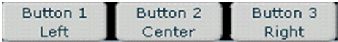

= UX Designer Guide
:doctype: book
:toc: left
:toclevels: 3
:sectanchors:
:sectlinks:
:sectnums:
:icons: font
:source-highlighter: highlight.js

[.lead]
*<DRAFT>* +
*ISIS Technical Report TR-?????* +
*GMX User's Guide* +
*Using GMX to Create a GUI*

== Architecture Overview

The GMX is a lightweight user interface architecture designed for:

* Rapid prototyping of complex, dynamic user interfaces
* Fast Execution Speed
* Low Memory Use
* Easy Extension
* Portability across architectures

This is achieved via a separation of functionality within the GMX platform into several core subsystems:

* A real-time data store: holding the data content for display
* A Layout Manager, responsible for displaying frames and subframes, containing components
* A set of Components, objects which interact with the user to take input and display output

This architecture presents a logical interaction mechanism to the controlling services, allowing key functionality to be managed separately. Specifically:

* Services that are sources of data, or recipients of user inputs can interact primarily with the real-time data store, without being concerned about presentation matters
* Presentation concerns can be isolated in a display controller service
* Components can be created and evolved independently

This separation of concerns allows a maximum of development parallelism, minimizing the interactions and dependencies between these activities. Data interaction services can be developed and debugged with a simple layout. Layouts and visualization interactions can be developed prior to data availability and independent of the data services. Components can be developed, starting with simple widgets that conform to the data contract, and evolved into polished widgets. Also, the entire look and feel can be modified, independent of the data.

These subsystems are related via interfaces:

* The layout specification indicates the components (by component name), and defines the specifically identified data records associated with a specific component instance
* The data manager creates and updates instances of data with specifically identified records
* The component instance gets records, which contain fields (or sub-records) conforming to the component interface contract

Services interact with the GMX via a simple socket, using a small set of XML messages. This has several advantages:

* *Performance*: The user interface component can be decoupled from the rest of the system. Consequently, the user interface can be lightweight, requiring a minimal amount of computational resources
* *Testability*: Test drivers can be as simple as a "netcat", which can run the user interface thru its entire set of capabilities. Other, more sophisticated test driver tools have also been developed
* *Debugging*: The data stream from any application can be captured to replicate functionality or performance problems
* *Portability*: Virtually every modern development system can support TCP/IP communications. This, plus a display & input device is all that is required for a GMX platform. GMX has been implemented in Adobe Flash, but is also being ported to QT. We anticipate the system will run well on embedded microcontroller platforms
* *Development Flexibility*: Systems can be developed using a flash/browser desktop environment available everywhere, and later be migrated to secure, embedded, real-time platforms with proven safety, timing, and infosec properties

== Components

Components are widgets laid out on a GUI frontend. They vary, ranging from a simple "form component" like an HBox (a horizontal container for other components - Figure 1) or a Button to a complicated, specialized component like an attitude indicator (Figure 2) that displays a lot of information at once.

.HBox Containing 3 Buttons

.Attitude Indicator

A component consists of a layout object and may or may not contain one or more data objects. For example, an Hrule (Figure 3) consists of a layout object, but no data objects. An attitude indicator (Figure 2,) on the other hand, consists of a layout object and three data objects. As another example, a SpinBox (Figure 4) consists of a layout object and a data object, which happens to be user-updatable.

.Hrule

.SpinBox
image::images/spinbox.png[]

Layout objects and data objects can be created and updated independently of one another by sending GMX layout messages or data messages. Layout messages can create/update both layout and data objects and can associate layout objects with data objects; data messages can create/update data objects only.

=== Layout Messages

A user can create and update layout objects and data objects by sending GMX an XML "layout message," effectively adding, removing, or modifying components on a GUI front-end. These layout messages implicitly describe a tree composed of parent and child components. As an example, the layout message in Figure 6 produces the GUI front-end in Figure 7:

[source,xml]
----
<fn:invoke fn="set_ISISFormLayout"
  xmlns:fn="http://isis.vanderbilt.edu/gmx/function"
  xmlns="http://isis.vanderbilt.edu/gmx/layout">
  <fn:args>
    <fn:arg>
      <Parent luid="mainLuid" id="PlanMissionSmallPortal">
        <HBox luid="hbox1" ruid="hbox1" padding="0" backgroundColor="000000">
          <Button fid="button1" label1="ButtonTop" label2="ButtonBottom"/>
          <ComboBox cuid="combobox1" rowCount="2"/>
          <HBox luid="hbox2" padding="0" backgroundColor="000000">
            <Label text="sampleText"/>
            <AttitudeIndicator ruid="attitudeIndicator1">
              <field fid="rollFid" name="roll"/>
              <field fid="pitchFid" name="pitch"/>
              <field fid="sideSlipFid" name="sideSlip"/>
            </AttitudeIndicator>
          </HBox>
        </HBox>
      </Parent>
    </fn:arg>
  </fn:args>
</fn:invoke>
----

.Resulting GUI

.Resulting Parent/Child Layout Tree

NOTE: The topmost node of this tree has a Luid, "mainLuid." This must always be the case unless Form Manager is being used.

This particular layout message creates several layout objects (see Figure 8) and data objects (i.e. the Combobox's collection) and associates these data objects with layout objects (like the Combobox and its collection.) Note that the layout message does not assign values to any data objects. To better understand this, it will be helpful to understand the properties of a component (Figure 9.)

[source]
----
class Component
    Component* parent
    List<Component*> children
    Luid luid
    Collection* collection
    Record* record
    Map<Name->Field> fields
    Map<Name->String> values
    GuiWidget* widget //(not all components have this)
----

The parent and list of children are implicitly created by GMX when it receives a layout message. A Layout Unique IDentifier (LUID) is a unique string among a layout that can be used to "prune" the layout tree by sending new layout messages whose topmost luid is the same as an existing luid. The new layout then replaces the old one from the matching luid's node on downward. For example, Figure 8 contains the layout tree from the layout message in Figure 6. The components with luids are indicated as such.

.Layout Tree w/ luids

If a new layout message with topmost luid "hbox2" is sent...

[source,xml]
----
<fn:invoke fn="set_ISISFormLayout"
xmlns:fn="http://isis.vanderbilt.edu/gmx/function"
xmlns="http://isis.vanderbilt.edu/gmx/layout">
  <fn:args>
    <fn:arg>
       <Parent luid="hbox2" id="PlanMissionSmallPortal">
         <Button fid="button1" label1="NewTop" label2="NewBottom"/>
       </Parent>
    </fn:arg>
  </fn:args>
</fn:invoke>
----

...then the old layout tree is pruned at the second HBox and replaced from that node downwards:

.New Layout Tree

.New GUI

A *R*ecord *U*nique *ID*entifier (RUID) is a unique string among a layout for identifying records; a *F*ield *Id*entifier (FID) is a unique string among a record for identifying fields, or data elements. Within a database, records serve as an namespace for containing fields. For example, the Gauge in the original layout (Figure 7) contains a pointer to a record that contains the fields pitch, roll, and sideSlip. The values of these fields can be set directly in a layout message, as follows:

[source,xml]
----
...
  <AttitudeIndicator ruid="attitudeIndicator1">
    <field fid="rollFid" name="roll" value="5"/>
    <field fid="pitchFid" name="pitch" value="10"/>
    <field fid="sideSlipFid" name="sideSlip" value="0"/>
  </AttitudeIndicator>
...
----

The drawback to setting a value in a layout message is a loss of data retention. Every time this layout message is send (for example, when toggling between UI screens), the data will always be reset to the value in the layout message. To have data retention, values should only be set using Data Messages:

=== Data Messages

Data falls into a hierarchy of 3 separate classes: Collections, Records, and Fields. This hierarchy is illustrated in Figure X1

.Collection Tree

Only components that implement Tables or Lists require a collection. Note that fid's are only required to be unique within the context of a record while cuid's and ruid's are required to be globally unique. To build this data structure, first an ISISCollection message must be sent:

[source,xml]
----
<fn:invoke fn="ISISCollection"
    xmlns:fn="http://isis.vanderbilt.edu/gmx/function"
    xmlns="http://isis.vanderbilt.edu/gmx/collection">
   <fn:args>
     <fn:arg>
       <CollectionList>
         <Collection>
           <cuid>datagrid1</cuid>
           <ruidList>
             <Ruid>
               <ruid>r1</ruid>
               <ref></ref>
               <select>child</select>
             </Ruid>
             <Ruid>
               <ruid>r2</ruid>
               <ref>r1</ref>
               <select>last</select>
             </Ruid>
             <Ruid>
               <ruid>r1-1</ruid>
               <ref>r1</ref>
               <select>child</select>
             </Ruid>
             <Ruid>
               <ruid>r1-2</ruid>
               <ref>r1-1</ref>
               <select>last</select>
             </Ruid>
           </ruidList>
         </Collection>
       </CollectionList>
     </fn:arg>
   </fn:args>
</fn:invoke>
----

Note that each incoming Ruid to be added to the collection has two children used specify where it is placed in the collection—a *ref*erence ruid and a *select*or.

In order to add fields to the records in Figure X2, an ISISRecord message must be sent:

[source,xml]
----
<fn:invoke fn="ISISRecord"
   xmlns:fn="http://isis.vanderbilt.edu/gmx/function"
   xmlns="http://isis.vanderbilt.edu/gmx/record">
  <fn:args>
    <fn:arg>
      <RecordList>
        <Record>
          <ruid>r1</ruid>
          <fieldList>
            <Field>
              <fid>column1</fid>
              <value>col1</value>
            </Field>
            <Field>
              <fid>column2</fid>
              <value>col2</value>
            </Field>
            <Field>
              <fid>column3</fid>
              <value>col3</value>
            </Field>
          </fieldList>
        </Record>
      </RecordList>
    </fn:arg>
  </fn:args>
</fn:invoke>
----

This data structure could now be mapped to any number of components (like datagrids) by setting their "cuid" attribute to "datagrid1". The component used to visualize this data is not required to exist before this data structure is created so as to maintain model and view independence.

As stated previously, data messages exist only to create/update data objects. Looking at the original layout message in Figure 6, we see that the fields associated with the AttitudeIndicator have no value. By sending a data message (Figure 15,) these fields can be given a value. Likewise, if the fields already had values, these values could be modified. Note that Records are contained in a global RecordList, while Fields are contained in a fieldList associated with each Record.

[source,xml]
----
<fn:invoke fn="ISISRecord"
   xmlns:fn="http://isis.vanderbilt.edu/gmx/function"
   xmlns="http://isis.vanderbilt.edu/gmx/record">
   <fn:args>
     <fn:arg>
       <RecordList>
         <Record>
           <ruid>attitudeIndicator</ruid>
           <fieldList>
             <Field>
               <fid>roll</fid>
               <value>4</value>
             </Field>
             <Field>
               <fid>sideSlip</fid>
               <value>7</value>
             </Field>
             <Field>
               <fid>pitch</fid>
               <value>10</value>
             </Field>
           </fieldList>
         </Record>
       </RecordList>
     </fn:arg>
   </fn:args>
</fn:invoke>
----

=== Component Library

A nominal component library has been implemented, targeted at specific needs of ongoing projects. This library includes:

* Map – A map capable of showing MIL-STD 2525C graphics on a geo-referenced tiled background
* Video
* Robotic arm
* …

== Layout Manager Basics

=== How to edit layout manager files

The layout manager controls screen elements that change through include files. Consider the sample Layout Manager configuration shown below:

The main layout file sample_main is:

[source,xml]
----
<layout_manager xmlns:xi="http://www.w3.org/2001/XInclude">
  <VBox backgroundColor="ffffff" width="130mm" height="97.5mm">
    <xi:include luid="adminBar" href="sample_adminbar" width="130mm" height="8mm"/>
    <xi:include luid="tabPortal" href="sampleh_tab" width="130mm" height="89.5mm" backgroundColor="000000"/>
  </VBox>

  <HBox horizontalGap="0">
    <xi:include luid="mainPortal" href="systems_mp" backgroundColor="ffffff" width="113mm" height="89.5mm"/>
    <xi:include luid="samplehToolbar" href="sampleh_systems_tb" backgroundColor="ffffff" width="17mm" height="89.5mm"/>
  </HBox>
</layout_manager>
----

This will show the systems main portal and toolbar in the tabPortal. (The main portal file has includes for the main part and details part.)
(it will often contain multiple included files)

=== manifest.csv

All files associated with the layout manager must be in the manifest file.
The first uncommented line is the base xml file you wish to load into the GMX. Every additional line will have it's reference name and then the exact location of the file. See the example below.

[source]
----
sample_main

#THIS IS A COMMENT
sample_main, GMX_XML/cc/sample_main.xml
sample_adminbar, GMX_XML/cc/sample_adminbar.xml
----

=== sampleh_systems_mp, GMX_XML/cc/sampleh/sample_UI_0008/SystemsMP.xml

==== Shortcuts

Shortcuts are how layout elements are changed by the layout manager before being sent to the GMX. They can be sent directly from the service or imbedded in a record (in the layout command).

The format of the command is:

`|Shortcut|:filename:luid|:filename1:luid1|:filename2`

If a filename is the last element in the command, then the last luid specified is set the filename given. If a luid is the last element in the command, then the last file shown for that luid (or the default if it hasn't been shown), will be displayed.

To replace the admin bar with an alternative, the shortcut command is the following:

`|Shortcut|:sample_main:adminBar|:sample_adminbar2`

Similarly, to replace the samplehMainPortal with the test checklist main portal, the shortcut command is the following:

`|Shortcut|:sample_main:tabPortal|:sampleh_tab:samplehMainPortal|:test_checklists_mp`

To simply make sure that the sampleh tab is being displayed (with whatever main portal it was showing last) the shortcut command is:

`|Shortcut|:sample_main:tabPortal|:sampleh_tab`

Currently you must fully specify what layout you want to see/change. An xml file may be used in different places, e.g.

`|Shortcut|:sample_main:tabPortal|:sampleh_tab:samplehToolbar|:Toolbar1`
`|Shortcut|:sample_main:tabPortal|:test_tab:testToolbar|:Toolbar1`

So the two shortcuts above are showing the same toolbar, but in different applications.

==== initialData.csv

Each folder with layout xml files may contain an initialData.csv file. This file contains data to pre-populate any layout elements contained in the folder. This could be used to help the service writer determine the format of data elements he/she should use. Once the service is running, you may wish not to pre-populate the layout by simply not including the -initialData flag.

There are two types of rows in the csv file, one for ruids and one for cuids

Cuids rows should have "CUID, cuid_name, ruid_name1, ruid_name2, ruid_name3,..."

Ruid rows should have "RUID, ruid_name, fid, value, layout" (with the final two elements optional, if no value is given its default value will be "ruid_name:fid_name", no layout message means a blank layout attribute

Ruids with multiple fids must have multiple lines describing each fid...only one layout message per ruid, so last layout message will be used (blank layout messages will not overwrite previously defined)

See the wiki for GMX for more information about ruids and cuids.

Here is a snippet from the initialData.csv file in the cc directory:

[source,csv]
----
CUID, adminMainTabCuid, mtRow1, , child, mtRow2, , child, mtRow3, , child
RUID, mtRow1, mainTab, sampleh
RUID, mtRow2, mainTab, test
RUID, mtRow3, mainTab, ITEM
CUID, adminSubTabCuid, stRow1, , child, stRow2, , child
RUID, stRow1, subTab, Systems,|Shortcut|:sample_main:tabPortal|:sampleh_tab:samplehMainPortal|:sampleh_systems_mp
RUID, stRow2, subTab, Checklists,|Shortcut|:sample_main:tabPortal|:sampleh_tab:samplehMainPortal|:test_checklists_mp
----
